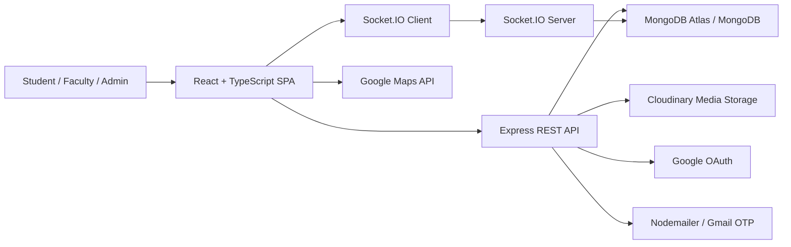

# KampusKart Project Report

Repository analyzed: `kalviumcommunity/S72_Gaurav_Capstone_KampusKart`  
Branch analyzed: `main`  
Latest commit inspected locally: `191526e updated readme`

## 0. Documentation Handbook

A full technical handbook now lives under the `docs/` folder. Start with `docs/README.md` and use it to navigate backend, frontend, deployment, and operations references.

## 1. Executive Summary

KampusKart is a full-stack campus portal built for MIT ADT University. The core idea is to bring common student and faculty needs into one web application: campus navigation, announcements, events, complaints, lost and found, facilities, club recruitment, profile management, and real-time campus chat.

The project is implemented as a MERN-style application with a React + TypeScript frontend and a Node.js + Express + MongoDB backend. It also integrates Google Maps for campus navigation, Google OAuth for authentication, Cloudinary for image and file storage, Socket.IO for real-time chat, Nodemailer for OTP password reset, Netlify for frontend deployment, Render for backend deployment, and GitHub Actions for CI/CD.

From an interview perspective, KampusKart is a strong capstone project because it demonstrates:

- Full-stack architecture and API design
- Authentication and authorization
- Real-time communication
- Third-party API integration
- Cloud media upload and cleanup
- Admin and user workflows
- Search, filtering, pagination, and responsive UI
- Testing, CI/CD, and deployment readiness

## 2. Project Concept

Campus life usually depends on many disconnected channels: maps, notices, WhatsApp groups, complaint forms, lost item messages, club announcements, and informal communication. KampusKart solves this by acting as a single campus companion where authenticated users can access important campus services from one interface.

The application supports two broad user categories:

- Regular users: students or faculty who can browse campus information, report lost items, submit complaints, chat, and manage profiles.
- Admin users: trusted users configured through environment variables who can create, edit, delete, restore, and manage platform content.

## 3. Objectives

The main objectives of KampusKart are:

1. Centralize campus services in one web application.
2. Make campus navigation easier using an interactive map with searchable campus locations.
3. Provide structured workflows for lost and found items and complaints.
4. Allow administrators to manage public campus content such as news, events, facilities, and club recruitments.
5. Enable real-time communication through global chat.
6. Provide secure authentication using email/password and Google OAuth.
7. Support image and file uploads through Cloudinary.
8. Build a production-ready application with testing, deployment workflows, and environment-based configuration.

## 4. High-Level Architecture

KampusKart follows a client-server architecture.



### Frontend

The frontend is a React 18 single-page application built with Vite and TypeScript. It uses React Router for navigation, Tailwind CSS and Material UI for styling, Framer Motion for UI motion, Socket.IO Client for chat, and Google Maps libraries for the campus map.

### Backend

The backend is an Express 5 application running on Node.js. It exposes REST APIs, manages MongoDB data with Mongoose, verifies JWT tokens, supports Google OAuth through Passport.js, uploads files through Cloudinary, and runs Socket.IO for real-time chat.

### Database

MongoDB stores users, chat messages, lost and found items, complaints, news, events, facilities, and club recruitment records. Mongoose schemas define the structure, relationships, indexes, and validation rules.

### Deployment

The frontend is configured for Netlify, while the backend is configured for Render. GitHub Actions handle linting, testing, builds, deployment, security audits, and backend keep-alive pings.

## 5. Repository Structure

```text
S72_Gaurav_Capstone_KampusKart/
  netlify.toml
  docs/
    README.md
    architecture.md
    environment.md
    backend/
    frontend/
    testing.md
    deployment.md
    operations.md
    troubleshooting.md
  frontend/
    public/
      Logo.png
      Logo.webp
      manifest.json
      sw.js
      images/
    src/
      components/
        Chat/
        common/
        ui/
        CampusMap.tsx
        LostFound.tsx
        Complaints.tsx
        Events.tsx
        News.tsx
        Facilities.tsx
        ClubsRecruitment.tsx
        Profile.tsx
        Login.tsx
        Signup.tsx
      contexts/
        AuthContext.tsx
      hooks/
      theme/
      utils/
      App.tsx
      config.ts
    package.json
    vite.config.ts

  backend/
    config/
      cloudinary.js
      passport.js
    cron/
      deleteItems.js
      keepAlive.js
    middleware/
      authMiddleware.js
      validation.js
    models/
      User.js
      Chat.js
      LostFoundItem.js
      Complaint.js
      News.js
      Event.js
      Facility.js
      ClubRecruitment.js
    routes/
      auth.js
      chat.js
      lostfound.js
      complaints.js
      news.js
      events.js
      facilities.js
      clubs.js
      profile.js
      user.js
    tests/
    utils/
    server.js
    package.json

  .github/
    workflows/
      ci.yml
      cd.yml
      keep-alive.yml
```

## 6. Technology Stack

| Layer          | Technologies                                                                       |
| -------------- | ---------------------------------------------------------------------------------- |
| Frontend       | React 18, TypeScript, Vite, React Router, Tailwind CSS, Material UI, Framer Motion |
| Backend        | Node.js, Express 5, CommonJS, Mongoose, Socket.IO                                  |
| Database       | MongoDB, MongoDB Atlas-ready configuration                                         |
| Authentication | JWT, bcryptjs, Passport.js, Google OAuth 2.0                                       |
| Media Storage  | Cloudinary, Multer, Streamifier                                                    |
| Email          | Nodemailer for OTP password reset                                                  |
| Maps           | Google Maps JavaScript API, React Google Maps libraries                            |
| Testing        | Vitest, React Testing Library, Jest, Supertest                                     |
| DevOps         | GitHub Actions, Netlify, Render                                                    |
| Security       | Helmet, CORS whitelist, HPP protection, custom Mongo sanitization, rate limiting   |

## 7. Backend Implementation

The backend entry point is `backend/server.js`. It performs environment validation, configures middleware, connects to MongoDB, registers routes, creates an HTTP server, attaches Socket.IO, and starts scheduled background tasks.

### Core Backend Responsibilities

- Validate required environment variables.
- Apply security middleware: Helmet, HPP, custom MongoDB key sanitization, CORS.
- Parse JSON requests with size limits.
- Initialize Passport for Google OAuth.
- Register API route groups under `/api`.
- Connect to MongoDB using Mongoose.
- Start cron jobs for cleanup and keep-alive.
- Run Socket.IO with JWT-based socket authentication.

### Security Middleware

The backend uses:

- `helmet` for secure HTTP headers.
- `hpp` to prevent HTTP parameter pollution.
- A custom sanitizer to strip dangerous `$` and `.` keys from request bodies and params.
- CORS origin validation using localhost defaults plus `ALLOWED_ORIGINS`.
- `express-rate-limit` on sensitive operations such as login, signup, password reset, chat messages, and admin content writes.

### Authentication Flow

Authentication is handled through `backend/routes/auth.js`, `backend/models/User.js`, and `backend/middleware/authMiddleware.js`.

Email/password flow:

1. User signs up with name, email, and password.
2. Password is validated and hashed using bcrypt before saving.
3. Server returns a JWT valid for 24 hours.
4. Frontend stores the token in localStorage or sessionStorage depending on the remember preference.
5. Protected routes send the token in the `Authorization: Bearer <token>` header.
6. Middleware verifies the token and attaches the user to `req.user`.

Google OAuth flow:

1. Frontend redirects the user to `/api/auth/google`.
2. Passport.js handles Google OAuth.
3. Existing users are linked by Google ID or email.
4. New Google users are created without requiring a password.
5. Backend redirects to the frontend callback URL with a JWT.
6. Frontend validates the token format and fetches the profile.

Password reset flow:

1. User requests password reset with email.
2. Backend generates a 6-digit OTP.
3. OTP is hashed with SHA-256 before storage.
4. OTP expires after 15 minutes.
5. Reset verifies OTP using timing-safe comparison.
6. New password is saved and hashed by the User model hook.

### Authorization

Admin authorization is email-based. The backend reads `ADMIN_EMAILS` from environment variables and checks whether the logged-in user's email appears in that list. This keeps admin assignment simple for a capstone project and avoids needing a separate role-management UI.

Admin users can:

- Add, update, and delete news, events, facilities, and club recruitment posts.
- Manage all complaints and lost/found items.
- Restore soft-deleted records.
- Permanently delete records.
- Trigger manual cleanup of expired records.

## 8. Database Models

### User

File: `backend/models/User.js`

Stores account and profile information:

- Email, password, name, Google ID
- Phone number
- Profile picture stored as Cloudinary URL and public ID
- Major, year of study, gender, date of birth, program
- Password reset OTP hash and expiry

The schema includes password hashing middleware and a `comparePassword` method.

### LostFoundItem

File: `backend/models/LostFoundItem.js`

Represents lost or found posts:

- User reference
- Type: `lost` or `found`
- Title, description, location, date, contact
- Multiple images
- Resolution status and resolved timestamp
- Soft-delete fields
- Search and query indexes

### Complaint

File: `backend/models/Complaint.js`

Represents campus complaints:

- User reference
- Title, description, category
- Priority and department
- Status: `Open`, `In Progress`, `Resolved`, `Closed`
- Status history with comments and admin/user reference
- Images
- Soft-delete fields
- Query indexes for status, category, department, priority, and created date

### Chat

File: `backend/models/Chat.js`

Represents real-time chat messages:

- Sender reference
- Message text
- Attachments
- Reactions
- Read receipts
- Reply-to relationship
- Edited status and timestamp
- Soft-delete flag

The model includes methods for adding/toggling reactions and marking messages as read.

### News

File: `backend/models/News.js`

Stores campus news posts with title, description, date, category, images, and indexes for category/date queries.

### Event

File: `backend/models/Event.js`

Stores event details:

- Title, description, date, location
- Status
- Image
- Registration URL
- Contact information
- Operating hours
- Optional map location details

### Facility

File: `backend/models/Facility.js`

Stores campus facility directory items:

- Name, description, location, type, icon
- Multiple images
- Timestamps and query indexes

### ClubRecruitment

File: `backend/models/ClubRecruitment.js`

Stores recruitment announcements:

- Title, description, club name
- Start and end dates
- Form URL
- Image
- Contact information
- Status: `Open` or `Closed`

## 9. API Modules

| API Prefix        | Responsibility                                                                |
| ----------------- | ----------------------------------------------------------------------------- |
| `/api/auth`       | Signup, login, Google OAuth, forgot password, reset password, token refresh   |
| `/api/profile`    | Full profile read/update with profile image upload                            |
| `/api/user`       | Basic profile read/update                                                     |
| `/api/lostfound`  | Lost/found CRUD, search, filters, resolve, admin restore/delete/cleanup       |
| `/api/complaints` | Complaint CRUD, filters, status history, admin restore/delete/cleanup         |
| `/api/news`       | Public news listing, admin create/update/delete                               |
| `/api/events`     | Public event listing, admin create/update/delete                              |
| `/api/facilities` | Public facility listing, admin create/update/delete                           |
| `/api/clubs`      | Public club recruitment listing, admin create/update/delete                   |
| `/api/chat`       | Chat message pagination, send, edit, delete, reactions, read receipts, search |
| `/api/health`     | Health check for monitoring and keep-alive                                    |

## 10. Frontend Implementation

The frontend entry points are `frontend/src/main.jsx`, `frontend/src/App.tsx`, and `frontend/src/contexts/AuthContext.tsx`.

### Routing

`App.tsx` defines application routes using React Router. Feature routes are lazy-loaded using `React.lazy` and wrapped in a `ProtectedRoute` component when authentication is required.

Public routes:

- `/`
- `/login`
- `/signup`
- `/forgot-password`
- `/auth/google/callback`
- `/privacy`
- `/terms`

Protected routes:

- `/home`
- `/chat`
- `/lostfound`
- `/complaints`
- `/campus-map`
- `/profile`
- `/events`
- `/news`
- `/facilities`
- `/clubs-recruitment`

### Authentication Context

`AuthContext.tsx` centralizes frontend authentication behavior:

- Maintains current user and token state.
- Reads stored tokens from localStorage or sessionStorage.
- Fetches profile after token initialization.
- Supports login, signup, Google login, logout, and profile update.
- Refreshes JWT tokens before expiry.
- Retries transient login/signup failures, which helps when the Render backend is waking up.

### Frontend Configuration

`frontend/src/config.ts` defines environment-sensitive API URLs:

- `API_BASE`
- `SOCKET_URL`
- `isProduction`

In production, the frontend points to the Render backend unless overridden by Vite environment variables.

## 11. Feature Modules

### 11.1 Landing and Home

Files:

- `frontend/src/components/Landing.tsx`
- `frontend/src/components/Home.tsx`
- `frontend/src/components/KampusKartNavbar.tsx`

The landing page introduces the product to unauthenticated users and guides them to login or signup. The home page acts as the authenticated dashboard with feature cards for all major modules. The navbar adapts based on login state and locks protected feature links behind authentication.

### 11.2 Campus Map

File: `frontend/src/components/CampusMap.tsx`

The campus map uses Google Maps to display MIT ADT campus locations. The component defines a curated list of campus markers with latitude, longitude, category, and description.

Key functionality:

- Google Maps script loading through `useLoadScript`.
- Search and suggestions for locations.
- Map markers for campus buildings and landmarks.
- Info windows for selected locations.
- User location support.
- Mobile and desktop layouts.
- Fallback from advanced markers to classic markers when a map ID is not configured.

Interview angle: This module shows external API integration, map state handling, search UX, and responsive design.

### 11.3 Lost and Found

Frontend: `frontend/src/components/LostFound.tsx`  
Backend: `backend/routes/lostfound.js`  
Model: `backend/models/LostFoundItem.js`

Users can create lost or found item posts with images, location, date, description, and contact details. Listings support filtering by type, resolution status, and search query. Owners and admins can edit or delete items. Owners and admins can mark items as resolved.

Backend implementation highlights:

- Image upload to Cloudinary.
- Maximum 5 images per item.
- Image file type and size validation.
- Search suggestions endpoint.
- Pagination.
- Soft delete for normal deletion.
- Admin restore and permanent deletion.
- Cleanup for resolved items older than 14 days.

### 11.4 Complaints

Frontend: `frontend/src/components/Complaints.tsx`  
Backend: `backend/routes/complaints.js`  
Model: `backend/models/Complaint.js`

The complaints module allows users to raise campus issues with title, description, category, priority, department, and optional images. Admins can update statuses and maintain status history.

Key features:

- Complaint creation with image uploads.
- Filters by status and category.
- Search by title, description, category, or department.
- Pagination.
- Owner/admin update permissions.
- Admin-only status updates.
- Status history tracking.
- Soft delete, restore, and permanent delete.
- Automatic cleanup for old resolved or closed complaints.

Interview angle: This module is useful for explaining role-based behavior, state transitions, and audit/history tracking.

### 11.5 News

Frontend: `frontend/src/components/News.tsx`  
Backend: `backend/routes/news.js`  
Model: `backend/models/News.js`

News provides campus updates and announcements. Any authenticated user can view news, while admins can add, edit, or delete posts with images.

Key features:

- Category filtering.
- Search by title and description.
- Multiple image uploads.
- Cloudinary cleanup when images are removed or posts are deleted.
- Admin-only content management.

### 11.6 Events

Frontend: `frontend/src/components/Events.tsx`  
Backend: `backend/routes/events.js`  
Model: `backend/models/Event.js`

Events stores and displays campus events with registration links and optional location metadata.

Key features:

- Event listing with status filtering and search.
- Admin-only create/update/delete.
- Date validation to prevent creating events in the past.
- Registration URL validation.
- Contact information and map location fields.
- Cloudinary image upload and replacement.

### 11.7 Facilities

Frontend: `frontend/src/components/Facilities.tsx`  
Backend: `backend/routes/facilities.js`  
Model: `backend/models/Facility.js`

The facilities module acts as a searchable directory of campus services and infrastructure.

Key features:

- Facility name, location, type, description, icon, and images.
- Filtering by type.
- Search by name, description, or location.
- Admin-only create/update/delete.
- Cloudinary cleanup for removed images.

### 11.8 Clubs Recruitment

Frontend: `frontend/src/components/ClubsRecruitment.tsx`  
Backend: `backend/routes/clubs.js`  
Model: `backend/models/ClubRecruitment.js`

This module lists active and closed club recruitment drives.

Key features:

- Club name, title, description, start/end dates.
- Google Form or external application link.
- Contact information.
- Status filtering.
- Admin-only create/update/delete.
- Date range validation and form URL validation.

### 11.9 Global Chat

Frontend: `frontend/src/components/Chat/ChatWindow.tsx`  
Backend: `backend/routes/chat.js`, Socket.IO logic in `backend/server.js`  
Model: `backend/models/Chat.js`

The chat system combines REST APIs and Socket.IO:

- Socket.IO handles joining chat, online users, typing indicators, previous messages, and real-time message events.
- REST endpoints handle sending messages, pagination, edits, deletes, reactions, read receipts, and search.

Chat features:

- JWT-authenticated socket connection.
- Global chat room.
- Message pagination.
- File and image attachments.
- Emoji reactions.
- Replies.
- Edit and soft-delete.
- Read receipts.
- Typing indicators.
- Online user list.
- Admin cleanup of orphaned attachments.

Interview angle: This is one of the strongest technical modules because it demonstrates real-time systems, REST/socket coordination, authentication, data modeling, and media handling.

### 11.10 Profile

Frontend: `frontend/src/components/Profile.tsx`  
Backend: `backend/routes/profile.js`  
Model: `backend/models/User.js`

Users can view and update profile data including:

- Name
- Phone
- Major
- Year of study
- Gender
- Date of birth
- Program
- Profile picture

Profile pictures are uploaded to Cloudinary, and old profile images are deleted when replaced.

## 11.11 Frontend Feature Slices Architecture

To enable scalability and maintainability, the frontend has been refactored into a **feature slices** architecture. Each major feature (Lost & Found, Complaints, Events, Chat, News, Facilities, Clubs) is organized as a self-contained module with:

- **types.ts** - Domain-specific TypeScript interfaces (e.g., `LostFoundItem`, `Complaint`)
- **api.ts** - Centralized API functions for the feature (all fetch calls)
- **hooks/** - Custom hooks for feature-specific logic
- **components/** - UI components for the feature
- **index.ts** - Main export point for clean imports

Directory structure:

```
frontend/src/
  features/
    lostfound/
      types.ts, api.ts, hooks/, components/, index.ts
    complaints/
      types.ts, api.ts, hooks/, components/, index.ts
    events/
      types.ts, api.ts, hooks/, components/, index.ts
    chat/
      types.ts, api.ts, hooks/, components/, index.ts
    news/, facilities/, clubs/
      (same structure)
```

Benefits:

- **Modularity**: Each feature is self-contained and independent
- **Testability**: API calls are centralized and easier to mock
- **Type Safety**: Domain types are co-located with feature logic
- **Maintainability**: Clear folder structure reduces cognitive load
- **Performance**: Route-level lazy loading + tree-shaking

Page wrappers in `frontend/src/pages/` continue to serve as route-level lazy-load containers, importing components from the feature modules.

See [frontend/src/features/README.md](frontend/src/features/README.md) for detailed documentation and migration status.

## 12. Admin Functionality

Admin functionality is controlled by the `ADMIN_EMAILS` environment variable. This design avoids adding database role-management complexity while still supporting protected admin operations.

Admin capabilities include:

- Create, edit, and delete news.
- Create, edit, and delete events.
- Create, edit, and delete facilities.
- Create, edit, and delete club recruitment posts.
- Manage all lost/found items.
- Manage all complaints.
- Restore soft-deleted records.
- Permanently delete records.
- Trigger cleanup for expired records.

## 13. Search, Filtering, and Pagination

KampusKart uses search and filters across almost every major feature:

- Lost and found: type, resolved/unresolved, search, pagination.
- Complaints: status, category, search, pagination.
- Events: status, search, optional pagination.
- News: category, search, optional pagination.
- Facilities: type, search, optional pagination.
- Club recruitments: status, search, optional pagination.
- Chat: text search through MongoDB text index and message pagination.

On the frontend, feature pages use search bars, dropdown filters, active filter indicators, empty states, loading skeletons, and modal-based forms/details.

## 14. File Upload and Media Handling

Cloudinary is used for media storage across:

- Lost and found images
- Complaint images
- News images
- Event images
- Facility images
- Club recruitment images
- Profile pictures
- Chat attachments

The backend uses Multer memory storage and streams files to Cloudinary with `streamifier` or uploads data URIs. File deletion is handled when records are updated, deleted, or permanently removed.

Important implementation choices:

- Limits image uploads to 5 files in several modules.
- Validates image file types and file size.
- Stores both `url` and `public_id` so images can be displayed and later deleted.
- Uses soft delete for user-facing deletion where restoration may be needed.

## 15. Real-Time Communication Design

The chat system has two layers:

1. REST API layer for durable operations:
   - Create message
   - Edit message
   - Delete message
   - Add reaction
   - Mark as read
   - Search messages
   - Paginate old messages

2. Socket.IO layer for real-time events:
   - Join room
   - Receive previous messages
   - New message broadcast
   - Online users
   - Typing and stop typing
   - User disconnect
   - Message delete broadcast

Socket authentication verifies the JWT and confirms the user still exists in MongoDB before allowing the connection.

## 16. Security Implementation

KampusKart includes multiple security measures:

- Password hashing with bcrypt.
- JWT-based stateless authentication.
- Google OAuth with Passport.js.
- Admin authorization through controlled environment configuration.
- OTP password reset with hashed OTP storage.
- Timing-safe OTP comparison.
- CORS whitelist.
- Helmet security headers.
- HTTP parameter pollution protection.
- Custom Mongo key sanitization.
- Rate limiting for sensitive endpoints.
- Request size limits.
- File type and file size validation.
- Environment variables for all secrets.
- Production error handling that avoids leaking internals.

## 17. Testing Strategy

Frontend tests use Vitest and React Testing Library.

Covered areas include:

- Route module smoke tests.
- LostFound smoke tests.
- ErrorMessage component tests.
- Form validation utility tests.

Backend tests use Jest and Supertest.

Covered areas include:

- Auth middleware.
- Validation middleware.
- User model.
- Complaint model.
- Auth routes.
- Clubs routes.
- Events routes.
- LostFound routes.
- Email utility functions.

CI also runs linting, tests, production builds, and dependency audits.

## 18. CI/CD and Deployment

### CI Workflow

File: `.github/workflows/ci.yml`

Runs on pushes and pull requests to `main`, `master`, and `develop`.

Jobs:

- Frontend lint, test, build, and artifact upload.
- Backend lint and tests with a MongoDB service container.
- Security audit for frontend and backend dependencies.

### CD Workflow

File: `.github/workflows/cd.yml`

Runs on pushes to `main` and `master`.

Jobs:

- Build and deploy frontend to Netlify.
- Trigger backend deployment on Render through Render API.

### Keep-Alive Workflow

File: `.github/workflows/keep-alive.yml`

Runs every 14 minutes and pings the backend health endpoint. This helps reduce Render free-tier cold starts.

### Netlify Configuration

File: `netlify.toml`

Defines:

- Build command: `npm run build:verify`
- Publish directory: `dist` (base directory: `frontend`)
- Production API and socket URLs
- SPA fallback redirect to `index.html`
- Cache headers for static assets
- Fresh caching rules for service worker and manifest

## 19. PWA and Performance Features

The frontend includes:

- `manifest.json` with app metadata and icons.
- `sw.js` service worker for basic asset caching.
- Vite code splitting through lazy-loaded route components.
- Manual vendor chunks in `vite.config.ts` for MUI, Google Maps, Three.js, emoji packages, and Socket.IO.
- Skeleton loaders for app, page, map, profile, and chat loading states.
- Build verification scripts.

## 20. Design and UX System

The project includes `UI_UX_STANDARDS.md`, which documents the design system:

- Primary colors: dark primary, teal accent, orange secondary.
- Consistent card, modal, button, input, badge, and skeleton styles.
- Responsive layouts for mobile, tablet, and desktop.
- Accessibility guidance for ARIA labels, modals, focus states, semantic HTML, and keyboard navigation.
- Standardized loading, empty, and error states.

This shows that the project was not only coded feature-by-feature but also organized around maintainable UI consistency.

## 21. Key Challenges and Solutions

### Challenge 1: Combining many campus features without creating a messy codebase

Solution: The project separates feature concerns into frontend route components, backend route files, and dedicated Mongoose models. Shared logic is kept in common components, middleware, utilities, and hooks.

### Challenge 2: Secure authentication across REST and Socket.IO

Solution: REST routes use JWT middleware, and Socket.IO uses its own handshake authentication. Both verify the JWT and ensure the user exists before allowing protected actions.

### Challenge 3: Managing images and files safely

Solution: Cloudinary public IDs are stored with URLs. This allows the app to delete old files when images are replaced, deleted, or cleaned up. Multer memory storage avoids temporary disk file management.

### Challenge 4: Real-time chat synchronization

Solution: The chat module uses REST for persistent writes and Socket.IO for live UI updates. It also prevents duplicate messages on the frontend and supports message pagination for older history.

### Challenge 5: Render backend cold starts

Solution: The app includes an internal keep-alive service and a GitHub Actions scheduled workflow that pings `/api/health` every 14 minutes.

### Challenge 6: Admin and user permission boundaries

Solution: Admin checks are centralized around `req.user.isAdmin`, which is derived from `ADMIN_EMAILS`. Feature routes check ownership or admin permission before updates and deletes.

### Challenge 7: Handling stale or expired content

Solution: Lost/found and complaints use soft delete, restore, permanent delete, and cron-based cleanup. Resolved items and closed complaints can be cleaned after a fixed time period.

### Challenge 8: Keeping frontend UX consistent

Solution: The project documents UI standards and uses shared common components for modals, image upload, status badges, error messages, success messages, and skeleton loaders.

## 22. Outcomes

KampusKart delivers a production-oriented campus portal with:

- A working full-stack architecture.
- Secure login and Google OAuth.
- Real-time global chat.
- Interactive campus map.
- CRUD workflows for key campus services.
- Admin-controlled content management.
- Cloud file upload and cleanup.
- Responsive design with consistent UI standards.
- Automated testing and CI/CD workflows.
- Deployment configuration for Netlify and Render.

The project demonstrates the ability to build, organize, secure, deploy, and maintain a complex full-stack application.

## 23. Interview Explanation

### Short Pitch

KampusKart is an all-in-one campus portal for MIT ADT University. It centralizes campus navigation, news, events, facilities, lost and found, complaints, club recruitment, profiles, and real-time chat. I built it as a full-stack app using React, TypeScript, Node.js, Express, MongoDB, Socket.IO, Google Maps, Cloudinary, and Google OAuth. The project also includes admin workflows, testing, CI/CD, and production deployment setup.

### Architecture Answer

The frontend is a React single-page app built with Vite and TypeScript. It communicates with an Express backend through REST APIs and Socket.IO. MongoDB stores user and feature data, Cloudinary stores uploaded media, Google OAuth handles social login, Google Maps powers campus navigation, and Nodemailer supports OTP password reset. The frontend is configured for Netlify deployment, and the backend is configured for Render.

### Security Answer

I used JWT for authentication, bcrypt for password hashing, Passport.js for Google OAuth, rate limiting on sensitive endpoints, CORS whitelisting, Helmet headers, HPP protection, custom Mongo key sanitization, environment variables for secrets, and Cloudinary file validation. Admin access is controlled through configured admin emails.

### Real-Time Chat Answer

The chat system uses Socket.IO for real-time events and REST APIs for persistent actions. When a user connects, the socket handshake includes a JWT. The server verifies it, joins the user to the global chat room, sends previous messages, tracks online users, and broadcasts new messages, typing indicators, and deletes. Message editing, reactions, read receipts, attachments, and pagination are handled through REST endpoints.

### Database Answer

I modeled the database around feature entities: User, LostFoundItem, Complaint, Chat, News, Event, Facility, and ClubRecruitment. Mongoose schemas include field validation, references, indexes, soft-delete fields, and helper methods such as password comparison, message reactions, and read receipts.

### Deployment Answer

The project uses Netlify for the frontend and Render for the backend. GitHub Actions runs CI for linting, testing, builds, and dependency audits. CD builds and deploys the frontend to Netlify and triggers Render deployment through the Render API. There is also a keep-alive workflow that pings the backend health endpoint every 14 minutes.

## 24. Possible Interview Questions and Strong Answers

### What problem does KampusKart solve?

It solves fragmentation in campus life. Instead of students relying on different systems or informal channels for maps, complaints, events, lost items, and announcements, KampusKart brings these into one structured portal.

### Why did you choose React and Express?

React made sense for a dynamic, multi-page single-page application with protected routes, modals, filters, and real-time updates. Express was a good fit for building REST APIs quickly while keeping control over middleware, security, authentication, uploads, and Socket.IO integration.

### How do you protect private routes?

On the frontend, protected routes check whether a token exists in the auth context. On the backend, protected endpoints use JWT middleware that verifies the token, loads the user from MongoDB, removes the password field, and attaches the user to the request.

### How are admins handled?

Admin access is configured through `ADMIN_EMAILS` in the backend environment. During authentication, the backend checks if the logged-in user's email is in that list and attaches `isAdmin` to the user object.

### Why did you use soft delete?

Soft delete allows recovery and safer admin workflows. Lost/found items and complaints can be hidden from users but restored by admins if needed. Old soft-deleted records can later be permanently removed.

### How do uploads work?

The backend receives files through Multer memory storage and streams them to Cloudinary. The database stores each file's secure URL and Cloudinary public ID. The public ID allows cleanup when files are removed or records are deleted.

### How did you handle performance?

The app uses lazy-loaded route components, skeleton loaders, pagination, search filters, query indexes, vendor chunk splitting in Vite, optimized asset handling, and controlled API response sizes.

### What was the most technically challenging part?

The global chat was the most complex because it combines real-time socket events, JWT socket authentication, message persistence, attachments, replies, edits, reactions, read receipts, online users, and pagination.

### What would you improve next?

I would add finer role-based access control, push/email notifications for complaint updates, end-to-end tests, a dedicated admin dashboard, advanced map routing, and analytics for campus engagement.

## 25. Strengths of the Project

- Broad feature set with real campus use cases.
- Clean separation between frontend, backend, models, routes, middleware, and configs.
- Strong use of third-party integrations.
- Practical security controls.
- Real-time functionality through Socket.IO.
- Admin workflows with restore and cleanup support.
- Production deployment configuration.
- CI/CD and testing setup.
- Documented UI standards and security policy.

## 26. Limitations and Future Enhancements

Current limitations:

- Admin roles are email-based instead of database-managed roles.
- There is no dedicated analytics dashboard.
- Notifications are not yet deeply integrated.
- The chat is global rather than segmented by department, course, or group.
- End-to-end tests could be added for full user flows.

Future enhancements:

- Role-based access control with admin, moderator, student, faculty, and department staff roles.
- Push notifications for complaints, events, and chat.
- Department-specific complaint assignment.
- Map routing from current location to a selected campus location.
- Mobile app wrapper or PWA enhancements.
- Full admin dashboard with metrics and moderation tools.
- More detailed audit logs for admin actions.

## 27. Conclusion

KampusKart is a comprehensive full-stack campus portal that shows practical software engineering ability across frontend development, backend API design, database modeling, authentication, real-time systems, file uploads, security, deployment, and testing.

For an interview, the best way to present the project is to lead with the problem, explain the architecture clearly, highlight the real-time chat and admin workflows, then discuss how security, uploads, deployment, and testing were handled. This positions the project not just as a collection of pages, but as a production-style application with thoughtful engineering decisions.
